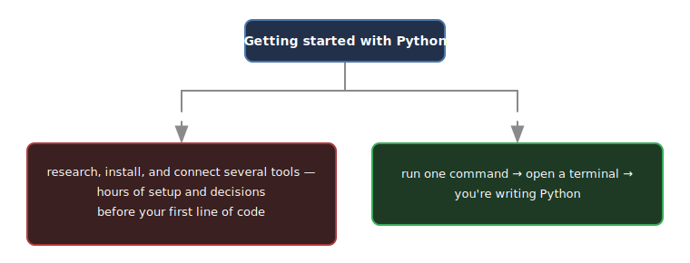
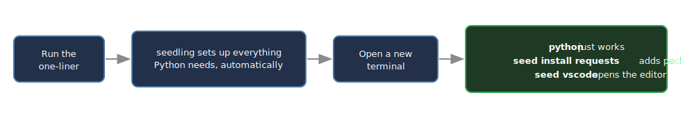
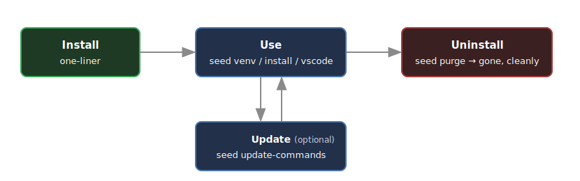

# seedling 🌱

[](https://github.com/cryocliff/seedling/actions/workflows/ci.yml)

**Go from nothing to writing Python in one command.** No prior setup, no
tools to install first, nothing to learn about how Python is packaged.
Run one line, open a terminal, and start coding. Under the hood it's the
same fast, modern tooling ([`uv`](https://astral.sh/uv)) — you just never
have to set it up. And it keeps everything in a single,
well-organized folder instead of scattering files across your system — so if
you ever want it gone, one command — `seed purge` — removes it all and leaves
your computer exactly as it was.

Already fluent in Python? seedling still earns its place. You get the same
one-line, reproducible install with nothing to configure, and every
interpreter, virtual environment, and cloned repo stays tidy in one
predictable location instead of sprawling across your machine. It's also a
fast way to standardize a team: point it at
[your own git host or a network share](docs/OFFLINE.md) via
[`seedling.conf`](seedling.conf), and hand junior or non-technical users a
fully preconfigured, batteries-included environment they install in a single
line.

---

## What seedling installs and manages for you



**All handled automatically, so you don't have to think about it:**

- 🐍 **Python itself** — the newest version, installed and ready (you don't
  even need Python beforehand)
- 📦 A **ready-to-use environment** with common tools already in it — just
  `python` and go
- 🧰 A portable **VS Code** editor, with Python extensions and settings
  already configured
- 🔁 One command to **clone and work on projects** from GitHub
- 🗒️ Sensible extras handled for you — **logs**, a **health check**, and a
  one-screen **summary** of everything installed
- 🧹 Completely **undoable** — nothing touches your system; `seed purge`
  removes all of it in one command

---

## Install

Nothing needs to be pre‑installed — not Python, not uv, nothing.

**macOS / Linux:**
```sh
curl -fsSL https://raw.githubusercontent.com/cryocliff/seedling/main/installers/install.sh | sh
```

**Windows (PowerShell):**
```powershell
irm https://raw.githubusercontent.com/cryocliff/seedling/main/installers/install.ps1 | iex
```

That one command does the whole setup for you — no follow-up steps, no
configuration. When it finishes, you're ready to code:



Open a new terminal and go:

```sh
python                    # newest Python, in the dev venv, ready to go
seed install requests     # add packages to the current venv
seed venv myproject       # create another isolated environment
seed vscode               # open the bundled VS Code
seed summary              # see everything seedling has installed
```

> Skip the default environment with `SEEDLING_AUTO_SETUP=false` before
> installing. On Windows you can also just download the repo and
> double‑click `install.cmd`.

---

## How it's organized (optional reading)

You don't need any of this to get started — `python` already works. But if
you're curious, everything lives under one folder, `~/seedling`. The
**Python** you install can have multiple isolated **environments** built from
it (so one project's packages never break another's); a ready-to-use one is
created for you and activates automatically in every new terminal.

```
~/seedling/
├── system/                 seedling's own runtime
│   ├── bin/                    uv and the seed-cli shim
│   ├── tool/                   the venv seed-cli runs in
│   ├── src/                    seedling's own source copy
│   ├── config/settings.json    settings (seed config)
│   ├── logs/                   one log file per day
│   ├── cache/uv/               uv's download cache
│   ├── certs/                  CA bundle for org installs
│   └── shell/                  the seed.sh / seed.ps1 hook
├── python/
│   ├── base/312/           seed python 312
│   └── venvs/myproject/    seed venv myproject
├── extensions/
│   └── vscode/
│       └── app/            portable VS Code (bundled)
└── repo/
    └── myrepo/             seed repo-clone <url>
```

Nothing is written to `%APPDATA%`, `~/.vscode`, `~/.local/share`, or the
other places tools like this usually scatter files — it's all contained here,
which is why `seed purge` can remove every trace in one command.

---

## Everyday commands

Command names read predictably: a bare noun is the action (`python` installs,
`venv` creates), `noun-list` shows things, and **anything that deletes is a
`remove-*` command**.

| Command | What it does |
|---|---|
| `seed python [ver]` | Install an interpreter (newest stable if no version) |
| `seed venv <name>` | Create an isolated environment |
| `seed activate <name>` | Activate a venv in your current shell |
| `seed install <pkg...>` | Add packages to the active venv |
| `seed download-whl <pkg...>` | Download a package + its deps as wheels for an offline install |
| `seed vscode` | Open the bundled, portable VS Code |
| `seed repo-clone <url>` | Clone a git repo into `~/seedling/repo` |
| `seed summary` | One screen of everything installed |
| `seed health-check` | Verify the whole install is sound |
| `seed remove-user` | Wipe everything seedling created |

📖 The **[full command reference](docs/COMMANDS.md)** documents every command
and flag.

---

## Lifecycle: install, use, update, undo

seedling never changes itself behind your back, and it's always cleanly
reversible.



- **Updates are explicit.** The installer copies seedling's source into
  `~/seedling` and runs from that private copy. New commits on GitHub — or
  deleting wherever you downloaded it — change nothing until you run
  `seed update-commands`.
- **Uninstall is a single folder delete.** `seed purge` removes `~/seedling`
  and the shell hook; `seed purge-and-reinstall` wipes and rebuilds from
  scratch while preserving your cloned repos.

---

## For organizations 🏢

Everything above describes a default install from the internet. seedling is
also built to be **deployed** — by one person, to everyone else, on networks
where the usual Python setup path doesn't work:

- **No internet required.** Point installs, interpreters, and packages at a
  self-hosted git server, an internal index, or a plain file share. Run
  `build-offline.cmd` on a connected machine and it assembles the entire
  bundle — uv, interpreters, wheels, VS Code — for an air-gapped network.
- **No admin rights required.** Everything lands in one folder the user
  already owns. Nothing is written to the registry, `%APPDATA%`, or any
  system location.
- **Nothing for your users to configure.** You set the values once in
  [`seedling.conf`](seedling.conf) in the copy you distribute; everyone who
  installs from it inherits them. No flags, no environment variables, no
  setup instructions to get wrong.
- **One install root, many users.** A `{user}` token gives each person a
  private, conflict-free folder — with an elevated `admin-*` family for
  cross-user teardown when a machine is decommissioned.
- **Auditable and reversible.** Every command is logged in plain text,
  downloads are checksum-verified, `--preview` shows exactly what a removal
  would delete, and `seed purge` leaves the machine as it was.

📘 Start with the **[deployment guide](docs/DEPLOYMENT.md)** — it covers
configuration, rollout, and the questions a security review will ask.
For a fully disconnected network, see
**[offline installs](docs/OFFLINE.md)**.

---

## Documentation

**Using seedling**

- 📖 **[Using seedling](docs/GUIDE.md)** — installation, the folder layout,
  why `seed` is a shell function, the update model, uninstalling, and
  troubleshooting.
- 📋 **[Command reference](docs/COMMANDS.md)** — every command and flag.
- 🛡️ **[Design and safety](docs/DESIGN.md)** — why deletion is so defensive,
  what gets logged, how downloads are verified, unattended use.

**Deploying seedling**

- 📘 **[Deployment guide](docs/DEPLOYMENT.md)** — `seedling.conf`,
  shared-machine installs, admin teardown, rollout, security review.
- 📴 **[Offline / air‑gapped installs](docs/OFFLINE.md)** — running with no
  internet at all.

🗺️ Not sure where to look? The **[documentation map](docs/DOCUMENTATION.md)**
routes you from what you're trying to do to the right page.

**Contributing:** working on seedling itself? The
[contributor guide](docs/CONTRIBUTING.md) covers the edit → `seed update-commands`
loop, the source layout, and running the tests (`uvx pytest` from the repo
root — no setup needed).
