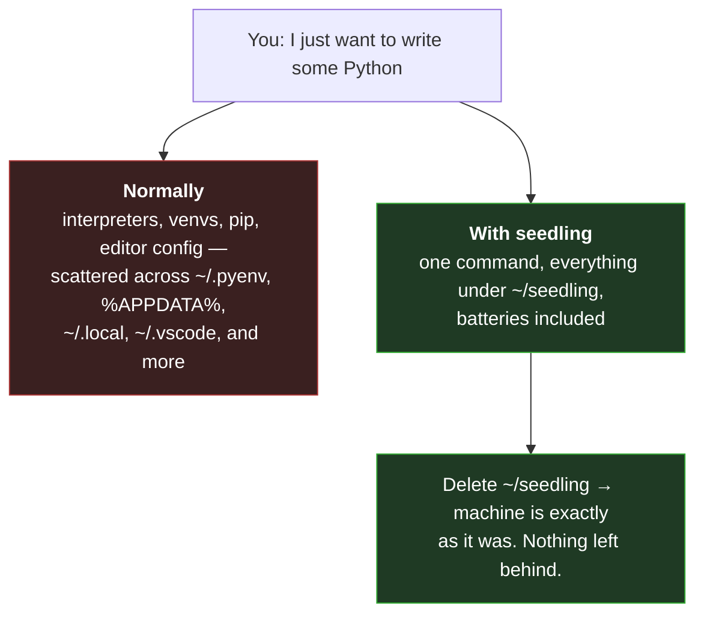
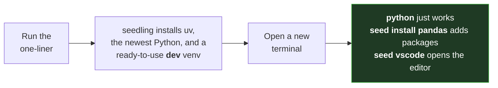
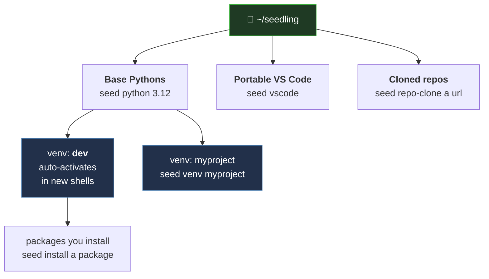
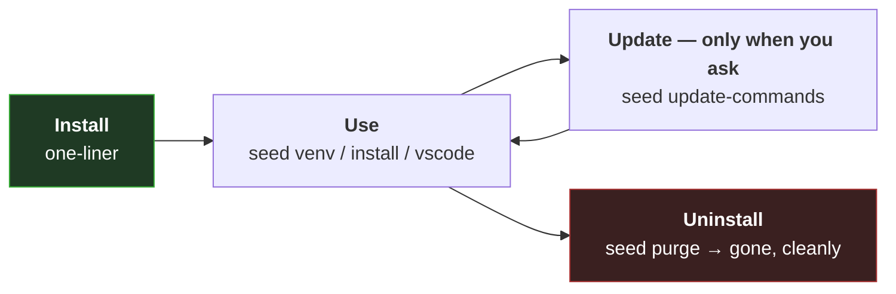

# seedling 🌱

[](https://github.com/cryocliff/seedling/actions/workflows/ci.yml)

**One command and one folder for everything Python.** Interpreters, isolated
project environments, an editor, cloned repos, config, and logs all live in a
single tidy folder — `~/seedling` — instead of scattered across your machine.
Built on [`uv`](https://astral.sh/uv). Delete the folder and your computer is
exactly as it was.

---

## Why seedling?

Getting started with Python is usually the hard part. You don't just install
"Python" — you end up juggling **interpreter versions**, per‑project
**virtual environments** (isolated package sets so one project's libraries
don't break another's), a package installer, and an editor. The usual tools
(`pyenv`, `venv`, `pip`, `conda`, …) each solve one piece and each scatter
files into a different hidden corner of your system.

seedling collapses all of that into a single command — **`seed`** — that puts
everything in one place and comes with sensible defaults already set up.



**What you get, all self‑contained:**

- 🐍 Any number of **Python versions**, side by side
- 📦 **Virtual environments** per project, with common tools pre‑installed
- 🧰 A portable **VS Code** — editor, settings, and extensions bundled in
- 🔁 A **git repo** manager for cloning and working on projects
- 🗒️ Automatic **logs**, a **health check**, and a one‑screen **summary**
- 🧹 True **reversibility** — nothing touches system folders; deleting one
  directory undoes it all

---

## Install

Nothing needs to be pre‑installed — not Python, not uv, nothing.

**macOS / Linux:**
```sh
curl -fsSL https://raw.githubusercontent.com/cryocliff/seedling/main/installers/install.sh | sh
```

**Windows (PowerShell):**
```powershell
irm https://raw.githubusercontent.com/cryocliff/seedling/main/installers/install.ps1 | iex
```

The installer bootstraps everything and leaves you ready to code:



Open a new terminal and go:

```sh
python                    # newest Python, in the dev venv, ready to go
seed install pandas       # add packages to the current venv
seed venv myproject       # create another isolated environment
seed vscode               # open the bundled VS Code
seed summary              # see everything seedling has installed
```

> Skip the default environment with `SEEDLING_AUTO_SETUP=false` before
> installing. On Windows you can also just download the repo and
> double‑click `install.cmd`.

---

## The mental model

Everything hangs off one folder. **Base Pythons** are the interpreters you
install; **venvs** are lightweight, isolated project environments built from a
base Python. A `dev` venv is created for you and auto‑activates in every new
terminal, so `python` works immediately.



---

## Everyday commands

Command names read predictably: a bare noun is the action (`python` installs,
`venv` creates), `noun-list` shows things, and **anything that deletes is a
`remove-*` command**.

| Command | What it does |
|---|---|
| `seed python [ver]` | Install an interpreter (newest stable if no version) |
| `seed venv <name>` | Create an isolated environment |
| `seed activate <name>` | Activate a venv in your current shell |
| `seed install <pkg...>` | Add packages to the active venv |
| `seed vscode` | Open the bundled, portable VS Code |
| `seed repo-clone <url>` | Clone a git repo into `~/seedling/repo` |
| `seed summary` | One screen of everything installed |
| `seed health-check` | Verify the whole install is sound |
| `seed remove-user` | Wipe everything seedling created |

📖 The **[full command reference](docs/DOCUMENTATION.md#command-reference)**
documents every command and flag.

---

## Lifecycle: install, use, update, undo

seedling never changes itself behind your back, and it's always cleanly
reversible.



- **Updates are explicit.** The installer copies seedling's source into
  `~/seedling` and runs from that private copy. New commits on GitHub — or
  deleting wherever you downloaded it — change nothing until you run
  `seed update-commands`.
- **Uninstall is a single folder delete.** `seed purge` removes `~/seedling`
  and the shell hook; `seed purge-and-reinstall` wipes and rebuilds from
  scratch while preserving your cloned repos.

---

## Documentation

- 📖 **[Full documentation](docs/DOCUMENTATION.md)** — every command,
  the folder layout, why `seed` is a shell function, the update model,
  multi‑user/organization deployment, and troubleshooting.
- 📴 **[Offline / air‑gapped installs](docs/OFFLINE.md)** — running with no
  internet at all.
- 🏢 **Organizations** can point installs and updates at a private git host
  or a network share (no github.com needed) via
  [`seedling.conf`](seedling.conf) — see
  [Deployment configuration](docs/DOCUMENTATION.md#deployment-configuration-seedlingconf).

**Contributing:** run the suite with `uvx pytest` from the repo root (no
setup needed). See the
[source layout](docs/DOCUMENTATION.md#source-layout-for-contributors) and
[running the tests](docs/DOCUMENTATION.md#running-the-tests).
